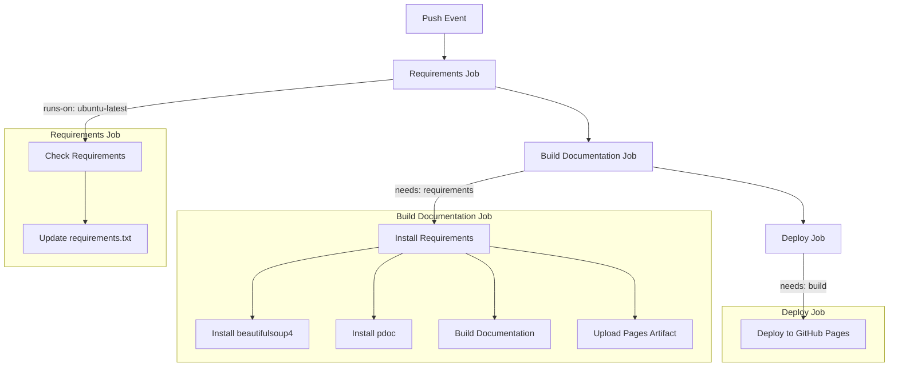

# LinkedIn Data Scraping


This report contains code to extract data from LinkedIn HTML files and convert them into a JSON file. The code is programmed to extract data from company pages of the about section. The data can be extracted from individual persons via the person search. The advantage is that several HTML files can be stored in the designated person or company folder and the data is stored in a single JSON.
This code may violate LinkedIn's Code of Conduct and is executed at your own risk. 

### Python Version
3.12 (Specifically tested on MacOS using Python 3.12.3 and 3.12.4)

## Run Locally

Clone the project

```bash
git clone https://github.com/SACCSF/NeonCRMLinkedIn.git
```

Go to the project directory

```bash
cd NeonCRMLinkedIn
```
Create virtual environment
```bash
# For MacOS and Linux
python3 -m venv .venv
source .venv/bin/activate

# For Windows
python -m venv .venv
".venv/Scripts/activate"
```

Install dependencies

```bash
  pip install -r requirements.txt
```

Prepare and download html files
- Go to [LinkedIn](linkedin.com) and log in to your existing account
- Search with the following link https://www.linkedin.com/company/company_keyword/about/ for the company you want to have the information of 
- Or search with the following link for the persons page to download https://www.linkedin.com/search/results/people/?keywords=company_keyword
- Safe all files in a separate companies or persons folder

Run the code
```bash
# For MacOS and Linux
python3 src/extract_persons_html_to_json.py path/to/persons/folder
python3 src/extract_companies_html_to_json.py path/to/companies/folder

# For Windows
python src/extract_persons_html_to_json.py path/to/persons/folder
python src/extract_companies_html_to_json.py path/to/companies/folder
```

Grab all data out of the files companies.json and persons.json. Example files can be found within the repository.

## Auto-generated Documentation
The documentation is automatically generated and can be found [here](https://saccsf.github.io/NeonCRMLinkedIn/). The workflow is as follows:


## Authors

- [@nicola-hermann](https://github.com/nicola-hermann)
- [@flawas](https://github.com/flawas)

